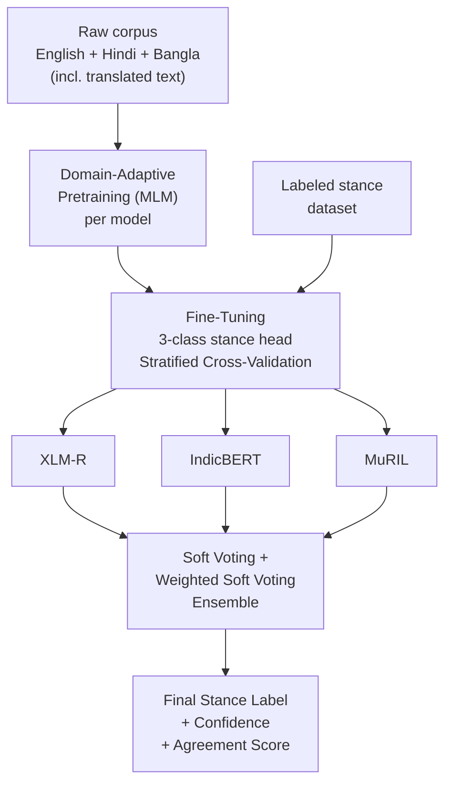

<div align="center">

# 🌍 AiSOME — Neural Nexus

### Multilingual Climate-Change Stance Detection

**English · हिन्दी · বাংলা**

[](https://www.python.org/)
[](https://pytorch.org/)
[](https://huggingface.co/docs/transformers)
[](https://scikit-learn.org/)
[](https://colab.research.google.com/)

Fine-tuned, domain-adapted transformer encoders + a performance-weighted ensemble to classify social media comments on climate change as **FAVOR**, **AGAINST**, or **NONE** — across three languages.

</div>

---

## 📖 Table of Contents

- [Overview](#-overview)
- [Stance Labels](#-stance-labels)
- [Tech Stack](#-tech-stack)
- [Models](#-models)
- [Architecture](#-architecture)
- [Repository Structure](#-repository-structure)
- [Getting Started](#-getting-started)
- [Running the Pipeline](#-running-the-pipeline)
- [Outputs](#-outputs)
- [Notes](#-notes)

---

## 🔎 Overview

Social media is full of opinions on climate change — but they're scattered across languages and scripts. **AiSOME** tackles this by:

1. **Domain-adaptively pretraining** three multilingual transformer encoders (via masked-language-modeling) on a combined English + Hindi + Bangla climate corpus, so each model learns climate-specific vocabulary and code-mixed/script-specific patterns.
2. **Fine-tuning** each pretrained model as a 3-class stance classifier, validated with **stratified cross-validation**.
3. **Ensembling** all three models' predictions with **soft voting** and **performance-weighted soft voting** for a final, more robust label — complete with confidence scores and agreement metrics.

The result is a pipeline that can score raw, unlabeled Hindi/Bangla comment files end-to-end.

## 🏷️ Stance Labels

| Label | Meaning |
|:---|:---|
| 🟢 `FAVOR` | Comment supports / agrees with climate action or climate science |
| 🔴 `AGAINST` | Comment opposes / denies climate action or climate science |
| ⚪ `NONE` | Comment is neutral or unrelated to the climate stance question |

## 🛠️ Tech Stack

| Layer | Technology |
|:---|:---|
| **Language** | Python |
| **Deep Learning** | PyTorch |
| **Transformers & Training** | Hugging Face `transformers`, `datasets`, `accelerate`, `evaluate` |
| **Modeling / Validation** | scikit-learn (stratified k-fold, classification metrics) |
| **Data Handling** | pandas, NumPy, openpyxl, xlrd |
| **Visualization** | Matplotlib (confidence & agreement plots) |
| **Compute & Storage** | Google Colab (GPU) + Google Drive |
| **Efficiency Tricks** | Dynamic padding, mixed precision, automatic batch-size fallback |

## 🤖 Models

Three multilingual encoders are trained independently, then combined:

| Model | Base Checkpoint | Strength |
|:---|:---|:---|
| **XLM-R** | `xlm-roberta-base` | Strong general-purpose multilingual baseline |
| **IndicBERT** | `ai4bharat/IndicBERTv2-MLM-only` | Specialized for Indic languages |
| **MuRIL** | `google/muril-base-cased` | Google's Indic-language encoder |

**Ensemble weights** (derived from validation F1 of each model):

```
IndicBERT : 0.885
MuRIL     : 0.888
XLM-R     : 0.854
```

## 🏗️ Architecture



**Pipeline stages:**

1. **Pretraining** — each base checkpoint continues MLM pretraining on the merged, cleaned multilingual corpus to absorb domain vocabulary.
2. **Fine-tuning** — a classification head is trained per model on labeled data using stratified CV, so evaluation folds are representative of the class balance.
3. **Ensembling** — `ENSEMBLE (CV).ipynb` loads all three fine-tuned checkpoints, generates fold-wise predictions, normalizes label variants, and combines probabilities via soft voting and performance-weighted soft voting.
4. **Scoring** — the same ensemble notebook can run inference on new, unlabeled Hindi/Bangla files with auto-detected text columns.

## 📁 Repository Structure

```
AISOME/
├── model-1/                          # XLM-R — pretraining + single-split fine-tuning
│   ├── xlmr-Pretraining.ipynb
│   ├── xlmr_Finetuning_(without_pre_process+weighted_fine_tune).ipynb
│   ├── Hindi_xlmr.xlsx               # predictions on Hindi test comments
│   └── Bangla_xlmr.xlsx              # predictions on Bangla test comments
│
├── model-2/                          # IndicBERT — pretraining + cross-validated fine-tuning
│   ├── indicBert-Pretraining.ipynb
│   ├── indicBert_Finetuning(CV).ipynb
│   ├── Hindi_indicBert.xlsx
│   └── Bangla_indicBert.xlsx
│
├── model-3/                          # Cross-validated versions of all 3 models + final ensemble
│   ├── xlmr_cv/
│   ├── indicBert_cv/
│   ├── muril_cv/
│   ├── ENSEMBLE (CV).ipynb           # soft-voting / weighted soft-voting ensemble
│   ├── Hindi_Ensemble (CV).csv       # final ensembled predictions (Hindi)
│   └── Bangla_Ensemble (CV).csv      # final ensembled predictions (Bangla)
│
└── dataset/
    ├── Pre-training/                 # native + translated corpora for MLM pretraining
    ├── Fine-tuning/                  # labeled data for the classification head
    ├── Preprocess and merge/         # cleaning & merging notebooks (per language)
    └── Testing/                      # unlabeled Hindi/Bangla test sets
```

## 🚀 Getting Started

These notebooks are built for **Google Colab** (they mount Google Drive for storage) and also run locally on Jupyter if the expected files exist relative to the working directory.

### Requirements

```bash
pip install "transformers>=4.48,<5" "accelerate>=1.2,<2" \
    datasets sentencepiece evaluate scikit-learn openpyxl xlrd joblib \
    torch pandas numpy matplotlib
```

> Each notebook also has its own install cell at the top — run that first.

### Data Expected

| File | Purpose |
|:---|:---|
| `English_train_data.csv` | English climate comments (`sentence`, `label`) |
| `final_dataset_hindi.csv` / `english_to_hindi.csv` | Native + translated Hindi text |
| `merged_bengali_dataset.csv` / `english_to_bengali.csv` | Native + translated Bangla text |
| `non_climate_none.csv` | Off-topic examples for the `NONE` class |
| `Hindi_500_test data.xlsx`, `Bangla_500_test data.xlsx` | Unlabeled comments to run inference on |

## ▶️ Running the Pipeline

1. **Pretrain** → open a model's `*-Pretraining.ipynb`, set your paths, run all cells to continue MLM pretraining on the combined corpus.
2. **Fine-tune** → open the matching `*-Finetuning*.ipynb`, point it at the pretrained checkpoint, run cross-validated fine-tuning for stance classification.
3. **Ensemble** → open `model-3/ENSEMBLE (CV).ipynb`, set `MODEL_PATHS` to your three fine-tuned checkpoints, then run all cells to fold-predict, ensemble, evaluate, and score new files.

## 📤 Outputs

| Output | Description |
|:---|:---|
| `predictions/fold_*` | Per-fold, per-model probability + prediction caches |
| `reports/` | Metrics CSVs, classification reports, agreement/confidence plots |
| `test_predictions/` | Predictions on new Hindi/Bangla files |
| `Hindi_Ensemble (CV).csv`, `Bangla_Ensemble (CV).csv` | Final per-comment predictions from every model + the ensemble, with per-class probabilities, vote counts, and agreement type (e.g. `3/3 Unanimous`, `2/3 Majority`) |

## 📝 Notes

- No `LICENSE` or `requirements.txt` is included yet — add both before treating this as a public release.
- Paths like `/content/drive/MyDrive/...` are Colab-specific — update the `ROOT` and data-path candidates in each notebook if running elsewhere.
